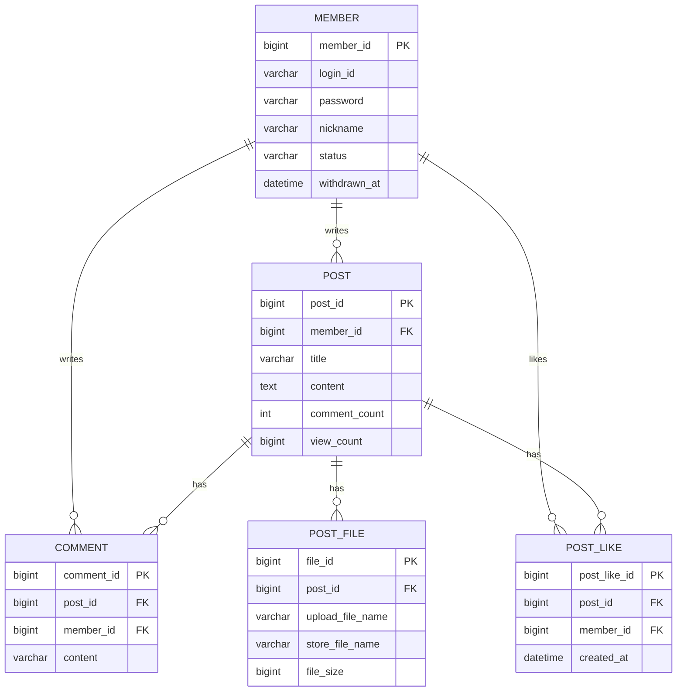

# Board

Spring Boot와 MySQL을 사용해 백엔드 기본기를 학습하기 위한 게시판 프로젝트입니다.


## 한눈에 보기

세션 기반 인증 + JPA + Querydsl로 구성된 SSR 게시판입니다. 각 Phase마다 "왜 이 기술을, 왜 이 방식으로" 도입했는지 판단 근거를 남기는 것을 원칙으로 진행했습니다.

### 핵심 아키텍처 결정

- **Repository 인터페이스/구현체 분리 설계**로 JDBC → JPA 전환을 Controller/Service 코드 변경 없이 구현체 교체만으로 수행
- **N+1 문제**를 ToOne 관계 fetch join + `default_batch_fetch_size` 안전망으로 해결하고, `open-in-view=false`로 지연 로딩 위험 제거
- **게시글 동시 수정 충돌**을 낙관적 락(`@Version`)으로 제어, 더티 체킹 타이밍 문제는 명시적 `flush()`로 해결
- **CSRF는 활성화**하되, WebFlux·HTTP Basic·동시 세션 제어·OAuth2 소셜 로그인 등은 게시판 규모 대비 실익이 낮다고 판단해 의도적으로 배제
- **Redis는 데이터 성격에 따라 원본 위치를 다르게** — 좋아요는 DB가 원본이고 Redis는 커밋 후 반영되는 사본, 조회수는 반영 전 증가분만 Redis에 모았다가 1분마다 DB에 일괄 반영, 세션은 Redis가 유일한 저장소
- **Redis 장애가 서비스 장애로 번지지 않게** — 명령 타임아웃 500ms, 연결이 끊기면 즉시 거절, 사본 데이터는 DB 폴백. 단 세션은 폴백이 불가능한 단일 장애 지점(SPOF)임을 인지하고, 운영이라면 Sentinel 또는 관리형 다중 가용 영역 구성으로 이중화한다고 판단

### ERD


---

## Post 테이블
| 컬럼 | 타입 | 설명 |
|---|---|---|
| post_id | BIGINT | 게시글 식별자, PK, AUTO_INCREMENT |
| member_id | BIGINT | 작성자, FK (member.member_id 참조) |
| title | VARCHAR(200) | 게시글 제목 |
| content | TEXT | 게시글 내용 |
| comment_count | INT | 댓글 개수 (역정규화, 기본값 0) |
| view_count | BIGINT | 조회수 (Redis에 쌓인 증가분을 1분마다 반영, 기본값 0) |
| created_at | DATETIME | 작성 시간 |
| updated_at | DATETIME | 수정 시간 |

## Member 테이블
| 컬럼 | 타입 | 설명 |
|---|---|---|
| member_id | BIGINT | 회원 식별자, PK, AUTO_INCREMENT |
| login_id | VARCHAR(50) | 로그인 ID, UNIQUE |
| password | VARCHAR(255) | 비밀번호 |
| nickname | VARCHAR(50) | 닉네임 |
| status | VARCHAR(20) | 회원 상태 (ACTIVE / WITHDRAWN), 기본값 ACTIVE |
| withdrawn_at | DATETIME | 탈퇴 시각 (NULL 허용) |
| created_at | DATETIME | 가입 시간 |
| updated_at | DATETIME | 수정 시간 |

## Comment 테이블
| 컬럼 | 타입 | 설명 |
|---|---|---|
| comment_id | BIGINT | 댓글 식별자, PK, AUTO_INCREMENT |
| post_id | BIGINT | 게시글, FK (post.post_id 참조) |
| member_id | BIGINT | 작성자, FK (member.member_id 참조) |
| content | VARCHAR(1000) | 댓글 내용 |
| created_at | DATETIME | 작성 시간 |
| updated_at | DATETIME | 수정 시간 |

## Post_file 테이블
| 컬럼 | 타입 | 설명 |
|---|---|---|
| file_id | BIGINT | 파일 식별자, PK, AUTO_INCREMENT |
| post_id | BIGINT | 게시글, FK (post.post_id 참조) |
| upload_file_name | VARCHAR(255) | 사용자가 업로드한 원본 파일명 |
| store_file_name | VARCHAR(255) | 서버 내부 저장용 파일명 (UUID, 충돌 방지) |
| file_size | BIGINT | 파일 크기 (byte) |
| created_at | DATETIME | 업로드 시간 |

## Post_like 테이블
| 컬럼 | 타입 | 설명 |
|---|---|---|
| post_like_id | BIGINT | 좋아요 식별자, PK, AUTO_INCREMENT |
| post_id | BIGINT | 게시글, FK (post.post_id 참조) |
| member_id | BIGINT | 좋아요를 누른 회원, FK (member.member_id 참조) |
| created_at | DATETIME | 좋아요 시각 (일별 랭킹의 날짜 기준, 앱 시각을 초 단위로 저장) |

`(post_id, member_id)` UNIQUE 제약으로 한 회원은 한 게시글에 한 번만 좋아요할 수 있다. 이 유니크 인덱스가 게시글별 좋아요 수 조회(`COUNT`, `GROUP BY`)도 함께 처리한다.

## 현재 테이블 설계
```sql
CREATE TABLE member (
    member_id BIGINT NOT NULL AUTO_INCREMENT,
    login_id VARCHAR(50) NOT NULL,
    password VARCHAR(255) NOT NULL,
    nickname VARCHAR(50) NOT NULL,
    status VARCHAR(20) NOT NULL DEFAULT 'ACTIVE',
    withdrawn_at DATETIME NULL,
    created_at DATETIME NOT NULL DEFAULT CURRENT_TIMESTAMP,
    updated_at DATETIME NOT NULL DEFAULT CURRENT_TIMESTAMP ON UPDATE CURRENT_TIMESTAMP,
    PRIMARY KEY (member_id),
    UNIQUE KEY uq_login_id (login_id)
);

CREATE TABLE post (
    post_id BIGINT NOT NULL AUTO_INCREMENT,
    member_id BIGINT NOT NULL,
    title VARCHAR(200) NOT NULL,
    content TEXT NOT NULL,
    comment_count INT NOT NULL DEFAULT 0,
    view_count BIGINT NOT NULL DEFAULT 0,
    created_at DATETIME NOT NULL DEFAULT CURRENT_TIMESTAMP,
    updated_at DATETIME NOT NULL DEFAULT CURRENT_TIMESTAMP ON UPDATE CURRENT_TIMESTAMP,
    PRIMARY KEY (post_id),
    CONSTRAINT fk_post_member FOREIGN KEY (member_id) REFERENCES member (member_id)
);

CREATE TABLE comment (
    comment_id BIGINT NOT NULL AUTO_INCREMENT,
    post_id BIGINT NOT NULL,
    member_id BIGINT NOT NULL,
    content VARCHAR(1000) NOT NULL,
    created_at DATETIME NOT NULL DEFAULT CURRENT_TIMESTAMP,
    updated_at DATETIME NOT NULL DEFAULT CURRENT_TIMESTAMP ON UPDATE CURRENT_TIMESTAMP,
    PRIMARY KEY (comment_id),
    CONSTRAINT fk_comment_post FOREIGN KEY (post_id) REFERENCES post (post_id),
    CONSTRAINT fk_comment_member FOREIGN KEY (member_id) REFERENCES member (member_id)
);

CREATE TABLE post_file (
    file_id BIGINT NOT NULL AUTO_INCREMENT,
    post_id BIGINT NOT NULL,
    upload_file_name VARCHAR(255) NOT NULL,
    store_file_name VARCHAR(255) NOT NULL,
    file_size BIGINT NOT NULL,
    created_at DATETIME NOT NULL DEFAULT CURRENT_TIMESTAMP,
    PRIMARY KEY (file_id),
    CONSTRAINT fk_post_file_post FOREIGN KEY (post_id) REFERENCES post (post_id)
);

CREATE TABLE post_like (
    post_like_id BIGINT NOT NULL AUTO_INCREMENT,
    post_id BIGINT NOT NULL,
    member_id BIGINT NOT NULL,
    created_at DATETIME NOT NULL DEFAULT CURRENT_TIMESTAMP,
    PRIMARY KEY (post_like_id),
    UNIQUE KEY uk_post_like (post_id, member_id),
    CONSTRAINT fk_post_like_post FOREIGN KEY (post_id) REFERENCES post (post_id),
    CONSTRAINT fk_post_like_member FOREIGN KEY (member_id) REFERENCES member (member_id)
);
```

## 학습 진행 상황

### 구현

#### JDBC 기초
- Spring Boot 프로젝트 초기 설정
- MySQL 연결 및 'post' 테이블 생성
- SQL CRUD 직접 실행
- JDBC 기본 동작 원리 학습
- `Connection`, `PreparedStatement`, `ResultSet` 사용
- 순수 JDBC로 게시글 CRUD 구현
- `AUTO_INCREMENT`로 생성된 게시글 ID 처리
- CRUD 반복 테스트 완료
- DataSource를 이용한 커넥션 획득 방식 추상화
- DriverManagerDataSource 적용
- HikariCP 커넥션 풀 적용

#### 트랜잭션
- post 테이블에 member_id, comment_count 컬럼 추가 (역정규화)
- member, comment 테이블 생성
- Member, Comment 도메인 및 Repository 구현 (순수 JDBC)
- Repository를 스프링 빈으로 전환, application.properties 기반 DataSource/TransactionManager 자동 등록 적용
- 트랜잭션 개념 학습 (원자성, 커밋/롤백, 자동/수동 커밋)
- 댓글 작성 + comment_count 증가 로직에 @Transactional 적용
- 트랜잭션 롤백 테스트 작성 (의도적 예외 발생 . 전체 롤백되는 것을 검증)

#### 예외 처리
- 체크 예외 vs 언체크 예외 차이 학습
- Post/Member/Comment Repository를 JdbcTemplate으로 전환
- SQLException 누수 문제 해결 (JdbcTemplate이 DataAccessException으로 자동 변환)
- 조회 결과 없음 처리를 EmptyResultDataAccessException으로 통일 (직접 예외 클래스 제거)
- 테스트를 @Transactional 기반 자동 롤백 방식으로 전환

#### Spring MVC
- 서블릿 -> MVC 패턴 -> 프론트 컨트롤러 -> DispatcherServlet 구조 학습
- 핸들러 매핑 / 핸들러 어댑터 / 뷰 리졸버로 이어지는 요청 처리 흐름 이해
- `@RequestMapping`. `@RequestParam`, `@ModelAttribute` 등 요청 매핑 / 파라미터 바인딩 학습
- `PostRepository.findAll()`, `CommentRepository.findByPostId()` 추가 (게시글 목록 / 댓글 목록 조회 준비)
- 동시간대 생성 데이터의 정렬 안정성을 위한 타이브레이커(`post_id`, `comment_id`) 적용 및 검증 테스트 작성
- Thymeleaf 기반 게시글 목록/상세/등록/수정(CRUD) 페이지 - 구현
- 폼 전송 객체(`PostForm`)를 도메인 객체(`Post`)와 분리 - Mass Assignment 방지 및 도메인 불변성 유지
- PRG 패턴 적용 및 `RedirectAttributes`로 새로고침 중복 등록 문제 해결
- 타임리프 유틸리티 객체(`#temporals`)로 날짜 포맷팅, `th:if`/`th:unless`로 빈 목록 처리
- 등록/수정 폼을 `th:object`, `th:field` 기반으로 개선 (id/name/value 자동 처리, 수정 폼에서 작성자 필드 제거)
- 화면 문구를 `messages.properties`로 외부화 (다국어는 실제 요구사항이 아니라 스킵, 메시지 외부화만 적용)
- Bean Validation 적용, 폼 객체를 등록용(`PostSaveForm`)/수정용(`PostEditForm`)으로 분리하여 검증 중복 방지
- 회원가입(`MemberController`, 로그인 ID 중복 확인용 `Validator` + `@InitBinder`) 및 로그인/로그아웃(`HttpSession` 기반) 구현
- 게시글 작성 시 작성자를 폼 직접 입력 대신 세션의 로그인 회원 정보로 자동 처리
- 스프링 인터셉터(`HandlerInterceptor`)로 로그인 인증을 공통 처리, `WebMvcConfigurer`로 등록
- 로그인 성공 후 원래 요청 경로로 복귀하는 `redirectURL` 처리
- `@SessionAttribute`로 세션 조회 코드 최소화
- 게시글 수정 시 작성자 본인 확인 추가
- 스프링 부트 기본 오류 처리(`BasicErrorController`) 활용, `templates/error/4xx.html, 5xx.html` 등록으로 기본 스프링 에러 페이지 대체
- `@ControllerAdvice`, `@ExceptionHandler`로 예외 처리 로직 일원화
- 영속성 계층 예외(`EmptyResultDataAccessException`)를 도메인 예외(`PostNotFoundException`) 변환 책임을 Repository로 이동
- Repository를 인터페이스/구현체로 분리 (`PostRepository` -> `JdbcTemplatePostRepository` 등) 추후 JPA 전환 시 Controller/Service 코드 변경 없이 구현체만 교체 가능하도록 설계
- 게시글 파일 첨부 기능 구현 - 종류/개수 제한 없이 업로드로 용량만 제한
- `FileStore` 인터페이스로 저장 방식을 추상화 (`LocalFileStore` 구현, 추후 S3 등으로 교체 가능하도록 설계)
- MockMvc 기반 Controller 계층 테스트 추가 (`PostControllerTest`, `MemberControllerTest`, `LoginControllerTest`)

#### JPA
- Member/Post/Comment를 JPA 엔티티로 매핑, `protected` 기본 생성자 추가
- Member.status를 String에서 MemberStatus enum으로 전환
- DB DEFAULT 컬럼(status, created_at, updated_at, comment_count)에 의존하던 로직이 JPA에서는 깨지는 것을 확인, `@PrePersist`/`@PreUpdate`로 엔티티가 null로 넘어가지 않고 기본값을 직접 책임지도록 수정
- MemberRepository, CommentRepository, PostRepository를 `JpaRepository` 상속으로 전환, 기존 JdbcTemplate 구현체는 빈 등록만 해제하고 참고용으로 보존
- `CommentRepository.findByPostId`는 원본 정렬 순서 유지를 위해 `@Query`로 직접 작성
- `PostRepository.incrementCommentCount()`는 `@Modifying` 벌크 쿼리로 전환
- `PostRepository.findAll()`을 인터페이스 내 `default` 메서드로 재정의하여 기존 정렬 기준(created_at DESC, post_id DESC) 유지
- 게시글 수정 로직을 Repository의 명시적 update() 대신 변경 감지(더티 체킹) 기반으로 전환, 이를 위해 `PostService` 신설 (트랜잭션 경계와 `PostNotFoundException` 변환 책임을 기존 Repository에서 Service로 이동)
- `ddl-auto=validate`로 JPA 엔티티 매핑과 기존 DDL 스키마의 정합성 검증

#### 페이징 처리
- 게시글 목록에 `Page`/`Pageable` 적용, 기본 10건씩 최신순(`createdAt`, `id` DESC)으로 조회
- 페이지 번호는 내부적으로 0부터 시작하지만, 화면에는 1부터 시작하는 번호로 변환해서 표시
- Post와 Member를 연관관계 매핑 없이 ON 조건으로 JOIN, JPQL 생성자 표현식으로 목록 전용 DTO(`PostListItem`)에 바로 매핑해 작성자 닉네임 함께 조회
- count 쿼리는 목록 조회 쿼리와 분리(`@Query`의 `countQuery`)해 불필요한 JOIN 제거
- 테스트 작성 중 테스트가 기존 DB 데이터와 공유되어 결과가 흔들리는 문제, 정렬 없는 페이징은 순서가 보장되지 않는다는 점을 직접 겪고 수정

#### JPA Auditing
- 손으로 관리하던 @PrePersist/@PreUpdate 기반 시간 처리를 Spring Data JPA Auditing으로 전환
- BaseTimeEntity(@MappedSuperclass)에 @CreatedDate/@LastModifiedDate 공통화, @EnableJpaAuditing 활성화
- 값이 항상 자동으로 채워지는 필드는 엔티티 생성자에서 아예 제거해 "받지만 안 쓰는" 파라미터를 없앰

#### 연관관계 매핑 (Post/Comment → Member/Post)
- Post.memberId, Comment.postId/memberId(Long)를 실제 객체 참조(@ManyToOne)로 전환
- 외래 키를 가진 쪽을 연관관계의 주인으로 설정, 양방향 대신 단방향으로만 매핑(불필요한 컬렉션/toString 순환 참조 방지)
- 모든 @ManyToOne에 fetch = LAZY 명시적으로 설정 (기본값 EAGER 회피)
- 순수 JdbcTemplate 참고용 구현체(Post/Comment)는 생성자 시그니처 변경으로 삭제, Git 히스토리로 이력 보존

#### REST API (학습용)
- `/api/v1/posts`(목록), `/api/v1/posts/{id}`(상세) — 실제 화면에서 사용하지 않는 학습 목적의 엔드포인트, JPA 조회 성능 최적화 실습용
- 응답을 `ApiResponse<T>`(success/data/message)로 통일, `Page`는 그대로 노출하지 않고 `PageResponse`로 변환해 API 스펙을 직접 통제
- API 전용 예외 처리(`ApiExceptionHandler`)를 `com.example.board.api` 패키지로 스코프 분리
- 댓글 상세 조회에서 작성자를 개별 지연 로딩으로 가져오며 N+1 발생을 직접 확인(SQL 로그로 post 1회 + 댓글 목록 1회 + 서로 다른 작성자 수만큼 추가 조회)

#### 조회 성능 최적화 (N+1, fetch join, OSIV)
- 학습용 API 상세 조회에서 댓글 작성자를 개별 지연 로딩하며 N+1을 직접 재현하고 SQL 로그로 확인
- ToOne 관계(Post.member, Comment.member)에 fetch join을 적용해 쿼리 수를 최소화 (컬렉션이 아니므로 페이징에 영향 없음)
- hibernate.default_batch_fetch_size를 전역 설정으로 추가해, fetch join을 걸지 않은 지연 로딩 지점에 대한 안전망 확보
- spring.jpa.open-in-view=false로 전환 — 기존 fetch join 최적화 덕분에 추가 코드 변경 없이 정상 동작 확인

#### Querydsl 도입
- 유지보수가 멈춘 원본 com.querydsl 대신 활발히 관리되는 OpenFeign 포크(io.github.openfeign.querydsl) 사용
- PostRepositoryCustom/PostRepositoryImpl 패턴으로 스프링 데이터 JPA와 연동 (이름 규칙: `<Repository명>Impl`)
- 게시글 제목/작성자 닉네임을 선택적으로 조합 검색 가능한 동적 쿼리 구현 (Where 다중 파라미터 방식)
- 검색 조건에 따라 count 쿼리의 join 여부를 다르게 해 불필요한 조인 비용 최적화

#### 동시성 제어 (낙관적 락)
- 게시글 동시 수정 시 Lost Update가 발생할 수 있음을 확인, `@Version` 기반 낙관적 락으로 해결
- 더티 체킹으로 인한 UPDATE는 트랜잭션 종료 시점에 실행되므로, `editPost()` 내에서 명시적 `flush()`를 호출해 충돌을 그 자리에서 감지
- `ObjectOptimisticLockingFailureException`을 `PostEditConflictException`으로 변환해 일관된 예외 처리 유지

#### Spring Security 도입
- 스프링 시큐리티 초기화 구조(SecurityBuilder, WebSecurity, FilterChainProxy, DelegatingFilterProxy) 학습
- 인증 프로세스(폼 인증, 기본 인증, RememberMe, 익명 인증, 로그아웃, 요청 캐시) 및 각 필터의 역할 학습
- 인증 아키텍처(Authentication, SecurityContext, AuthenticationManager, AuthenticationProvider, UserDetailsService) 학습
- 세션 기반 수동 인증(HttpSession, LoginCheckInterceptor)을 Spring Security로 전면 전환
- `CustomUserDetailsService`/`MemberDetails`로 UserDetailsService 커스터마이징 - Member 도메인 객체를 UserDetails 규격에 맞게 어댑팅
- BCryptPasswordEncoder 적용, 회원가입 시 비밀번호 암호화 저장
- `formLogin()`/`logout()`으로 로그인·로그아웃 처리를 필터 체인에 위임, 컨트롤러의 수동 세션 생성 로직 제거
- 손으로 관리하던 `redirectURL` 파라미터를 RequestCache/SavedRequest 표준 메커니즘으로 대체
- `authorizeHttpRequests()`로 인가 로직을 인터셉터 대신 SecurityFilterChain으로 이전
- 컨트롤러의 `@SessionAttribute` 기반 로그인 회원 조회를 `@AuthenticationPrincipal`로 전환
- MockMvc 테스트를 spring-security-test(`user()`, `authenticated()`/`unauthenticated()`) 기반으로 재작성
- 세션 관리(동시 세션 제어, 세션 고정 보호) 학습 - 동시 세션 제어는 게시판 성격상 불필요하다고 판단해 미적용, 세션 고정 보호는 기본 활성화된 채로 유지
- CSRF 보호 활성화 - Thymeleaf의 자동 hidden 토큰 삽입 활용, MockMvc 테스트는 spring-security-test의 csrf()로 대응
- OAuth2/OpenID Connect 개념 학습(4대 역할, Authorization Code Grant 흐름, Access/ID Token 구분, OAuth2UserService의 UserDetailsService 대응 구조)
- 실제 소셜 로그인은 회원 스키마 변경(비밀번호 nullable화 등) 비용 대비 실익이 낮다고 판단해 board엔 미적용, 개념 이해까지만 진행

#### Redis 도입 (조회수, 좋아요, 인기글 랭킹, 세션)
- 『개발자를 위한 레디스』로 자료구조, 캐싱 전략, 영속성, 복제, Lua를 학습한 뒤 설계 원칙을 먼저 정하고 적용
    - 확인과 변경은 명령 하나로(check-then-act 금지), O(n) 명령 금지, 모든 키에 수명 지정(원본 키 제외), Redis에는 DB 커밋이 확정된 사실만 반영, Redis의 파생 데이터는 DB로 재구성 가능하게
- 키 이름은 `RedisKeys` 한 곳에서만 생성(`board:` 접두사), 테스트는 Redis 1번 DB로 격리
- **조회수**: `SET NX EX 600`으로 10분 내 중복 조회 방지(회원은 id, 비회원은 UUID 쿠키) → Sorted Set에 증가분 누적 → 1분마다 `JdbcTemplate` 배치 UPDATE 후 읽은 만큼만 `ZINCRBY -n`으로 차감(그 사이 들어온 조회수 보존)
    - 화면 조회수 = DB 값 + Redis 증가분, 목록은 `ZMSCORE` 한 번으로 10개 조회
- **좋아요**: `post_like` 테이블이 원본. `INSERT IGNORE`와 UNIQUE 제약으로 멱등 처리, 커밋 후(`@TransactionalEventListener(AFTER_COMMIT)`) Lua 스크립트로 좋아요 Set과 일별 랭킹을 원자적으로 반영
    - 상세 페이지는 Set 캐시(1시간)로 좋아요 수와 내 상태를 한 번에 조회, 없으면 DB에서 재구성. 좋아요 0개 글도 캐시되도록 센티넬 멤버 사용
    - 목록의 좋아요 수는 Redis 대신 DB `GROUP BY` 한 방(`SCARD`가 "캐시 없음"과 "0개"를 구분하지 못해 설계 변경)
    - 요청 결과가 캐시와 어긋나면(이미 누름, 이미 취소) 캐시를 삭제해 다음 조회에서 재구성되도록 자가 복구
- **인기글 랭킹**: 일별 Sorted Set(8일 수명) → 1분마다 최근 7일을 `ZUNIONSTORE`로 합산(결과 키 5분 수명, 멱등) → 상위 10개를 DB와 대조해 표시
- **세션**: Spring Session으로 저장소를 Redis로 전환해 재시작 후에도 로그인 유지. 세션에는 엔티티 대신 회원 id, 로그인 id, 닉네임만 담은 직렬화 가능한 스냅샷을 저장하고 비밀번호는 인증 후 삭제
- **장애 대응 실험**: Redis를 직접 중단해 요청당 약 1초 지연을 측정, 연결 끊김 시 즉시 거절하도록 바꿔 0ms로 개선. 장애 로그는 스택트레이스 대신 원인 한 줄로
- 의도적으로 넣지 않은 것: 서킷 브레이커(Redis 하나에 대비 실익이 작음), 세션 Redis 이중화(학습 규모), 좋아요 수 반정규화(현재는 `COUNT`로 충분), 랭킹 재집계 배치

### 데이터베이스 설계
- 개념적/논리적 모델링 설계 완료 (Member/Post/Comment 엔티티, 관계, 참여도, 식별 여부 확정)
- 물리적 모델링 완료 (데이터 타입, 제약조건, 역정규화 확정)

## 문제 해결 기록

### 게시글 수정이 댓글 수를 과거 값으로 덮어쓰던 문제
- **문제**: 게시글을 수정하는 사이 댓글이 달리면 댓글 수가 수정 전 값으로 되돌아감
- **원인**: 더티 체킹이 만드는 UPDATE가 바뀐 컬럼만이 아니라 모든 컬럼을 포함함. 벌크 쿼리로 올린 `comment_count`는 `@Version`을 올리지 않아 낙관적 락도 막지 못함
- **해결**: 카운터 컬럼에 `@Column(updatable = false)`를 걸어 엔티티 UPDATE에서 제외. 이후 추가한 `view_count`도 처음부터 같은 방식 적용
- **확인**: 조회 → 벌크 증가 → 수정 저장 순서를 재현하는 테스트로 수정 전 실패, 수정 후 통과 확인

### Redis 장애 시 요청마다 1초씩 지연되던 문제
- **문제**: Redis를 중단하면 페이지는 뜨지만 상세 조회마다 약 1초씩 지연
- **원인**: Lettuce가 연결이 끊긴 동안 명령을 버퍼에 쌓고 재연결을 기다림. 명령 2개가 각각 타임아웃 500ms를 기다림
- **해결**: 연결이 끊기면 명령을 즉시 거절하도록 설정(`REJECT_COMMANDS`), 장애 로그도 원인 한 줄로 축약
- **확인**: 로그 타임스탬프로 실패 간격 500ms → 0ms 측정, Redis 재기동 후 자동 재연결 확인

### 좋아요 동시 요청 문제
- **문제**: 같은 회원의 동시 좋아요 요청이 중복 저장 예외를 내고, 동시 취소 요청은 랭킹 점수를 요청 수만큼 깎을 수 있음
- **원인**: "확인 후 저장"과 "조회 후 삭제" 모두 두 단계 사이에 다른 요청이 끼어들 수 있음(check-then-act)
- **해결**: 좋아요는 `INSERT IGNORE` 한 문장으로 확인과 저장을 합치고 반환 행 수(0/1)로 결과 판단. 취소는 반환 행 수가 1일 때만 랭킹 차감 이벤트 발행
- **확인**: 스레드 10개를 `CountDownLatch`로 동시에 출발시키는 테스트로 저장 1건, 성공 1번, 예외 0건 검증

### 주간 랭킹 점수가 매분 불어나던 문제
- **문제**: 1분마다 주간 랭킹을 합산할 때마다 점수가 2 → 4 → 6으로 증가
- **원인**: `ZUNIONSTORE`의 입력에 결과 키 자신이 포함됨. `unionAndStore`의 첫 인자도 합칠 재료라는 점을 놓침
- **해결**: 입력을 일별 키 7개로만 구성
- **확인**: 두 번 실행해도 결과가 같은지 검증하는 멱등성 테스트로 재현 후 수정 확인

### 로그인 상태에서만 목록 화면이 깨지던 문제
- **문제**: 모든 테스트는 통과했지만 실제로 로그인 후 목록에 들어가면 오류 페이지 표시
- **원인**: 목록 화면에 `getReferenceById`로 만든 회원 프록시를 넘겼고, 화면 렌더링 시점(OSIV 비활성)에 프록시가 닉네임을 읽으려다 `LazyInitializationException` 발생. 테스트 설정만 OSIV가 켜져 있어 테스트에서는 재현되지 않음
- **해결**: 세션의 회원 스냅샷(`MemberDetails`)을 그대로 화면에 전달. 테스트 OSIV 설정을 운영과 일치
- **확인**: 로그인 상태 목록 테스트를 추가해 수정 전 실패, 수정 후 통과 확인

## 설계 문서
- 데이터베이스 논리적 모델링 설계 결정사항 [docs/design.md](./docs/design.md) 참고